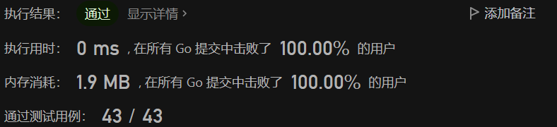

# 1491. 去掉最低工资和最高工资后的工资平均值

### 题目
[1491. 去掉最低工资和最高工资后的工资平均值](https://leetcode-cn.com/problems/average-salary-excluding-the-minimum-and-maximum-salary/)
给你一个整数数组 salary ，数组里每个数都是 唯一 的，其中 salary[i] 是第 i 个员工的工资。
请你返回去掉最低工资和最高工资以后，剩下员工工资的平均值。

### 分析
很多同学看到题目后直觉是排序后去头去尾算sum，再计算average，但是最快的排序算法也要O(NlogN)啊。

回想一下最开始学编程时候：
- 计算sum需要遍历
- 找到max需要遍历
- 找到min需要遍历

把三个遍历放到一起，一遍解决，O(N)

### 题解
```go
func average(salary []int) float64 {
    min, max := salary[0], salary[0]
    sum := 0
    for _, v := range salary {
        sum += v
        if v < min {
            min = v
        } else if v > max {
            max = v
        }
    }
    sum -= min
    sum -= max
    average := float64(sum) / float64(len(salary) - 2)
    return average
}
```

嘿嘿嘿 (￣▽￣*)~



